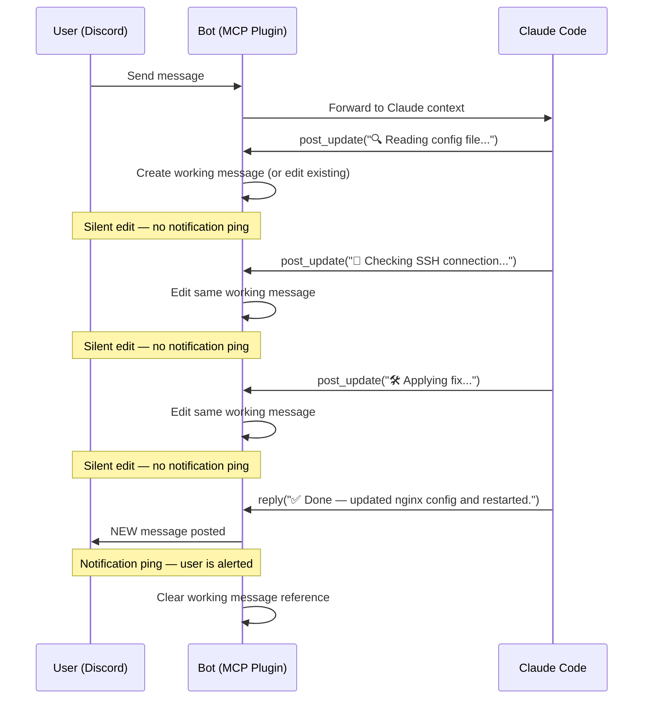
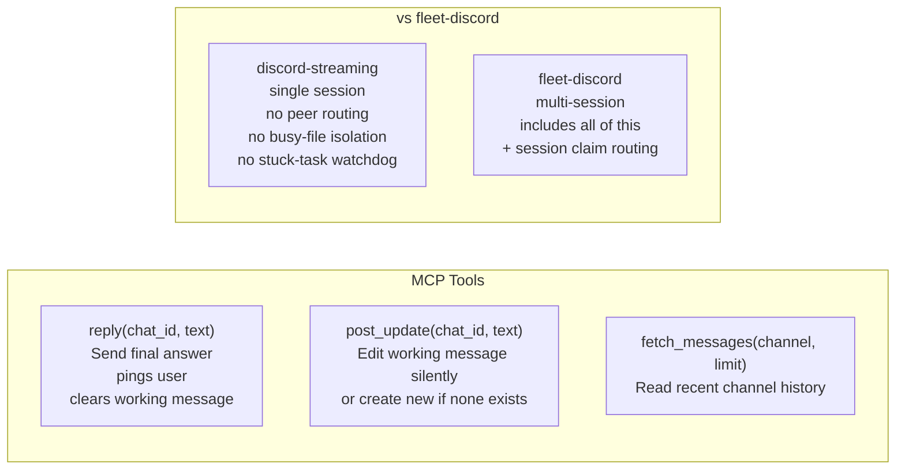

# discord-streaming

Claude Code Discord MCP plugin with **Tier-2 progress streaming** — Claude narrates its work in real time without spamming your notifications.


> Part of [The Agent Crafting Table](https://github.com/Agent-Crafting-Table) — standalone Claude Code agent components.

## How It Works





```
User message → Claude starts working
                ↓
          post_update("🔍 Reading config file...")    ← edits same msg, no ping
                ↓
          post_update("📡 Checking SSH connection...")  ← edits again
                ↓
          post_update("🛠️ Applying fix...")
                ↓
          reply("✅ Done — updated nginx config and restarted.")  ← NEW msg, pings you
```

One working message gets updated silently throughout the task. When the answer lands, you get a single notification.

## Tools

| Tool | Description |
|------|-------------|
| `reply(chat_id, text)` | Send final answer — pings user, clears working message |
| `post_update(chat_id, text)` | Edit working message silently, or post new one if none exists |
| `fetch_messages(channel, limit)` | Read recent channel history |

## Setup

**1. Create a Discord bot**

- Go to [discord.com/developers/applications](https://discord.com/developers/applications)
- New Application → Bot → copy token
- Enable: Server Members Intent, Message Content Intent
- Invite to your server with `bot` + `Send Messages` + `Read Message History` scopes

**2. Install**

```bash
git clone https://github.com/Agent-Crafting-Table/discord-streaming
cd discord-streaming
bun install
```

**3. Configure Claude Code**

Add to your `~/.claude/settings.json` (or project `.claude/settings.json`):

```json
{
  "mcpServers": {
    "discord": {
      "command": "bun",
      "args": ["/path/to/discord-streaming/src/server.ts"],
      "env": {
        "DISCORD_BOT_TOKEN": "your-bot-token-here"
      }
    }
  }
}
```

**4. Test**

Mention the bot in Discord — it should start typing. Send a multi-step request and watch the working message update.

## vs fleet-discord

This is the standalone version — no peer routing, no busy-file isolation, no watchdog. One Claude Code session, one bot.

If you're running **multiple Claude Code sessions** sharing one bot (fleet setup), use [fleet-discord](https://github.com/Agent-Crafting-Table/fleet-discord) instead — it includes all of this plus session-level claim routing.
